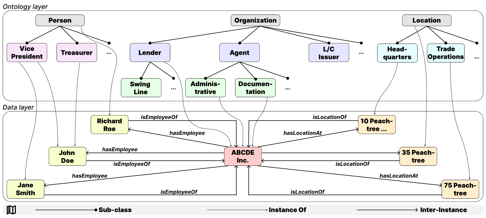

# KG‑QAGen  
**A Knowledge‑Graph‑Based Framework for Systematic Question Generation and Long‑Context LLM Evaluation**

[](https://example.com/your-homepage)  []  (https://huggingface.co/datasets/gtfintechlab/KG-QAGen-D)   [](https://arxiv.org/abs/YYYY.MM.NNNNN)   [](https://github.com/gtfintechlab/KG-QAGen)

---

KG‑QAGen is a benchmark and toolkit that leverages structured annotations of financial agreements to build knowledge graphs and automatically generate QA pairs at controlled difficulty levels, enabling fine‑grained evaluation of long‑context LLMs.

<p align="center">
  
</p>

---

## 📂 KG‑QAGen‑D Dataset

We release **KG‑QAGen‑D**, a 16,116-question benchmark derived from 170 SEC credit agreements (2013–2022). Each QA pair is tagged with a composite complexity level (L = #hops + #set‑ops + plurality), split into *Easy*, *Medium*, and *Hard*.

---

## ✉️ Contact

For questions or issues, please reach out to:

- Nikita Tatarinov: [ntatarinov3@gatech.edu](mailto:ntatarinov3@gatech.edu)
- Agam Shah: [ashah482@gatech.edu](mailto:ashah482@gatech.edu)

---

## 📑 Citation

If you use KG‑QAGen in your work, please cite:

```bibtex
@inproceedings{tatarinov2025kgqagen,
  title     = {{KG‑QAGen}: A Knowledge‑Graph‑Based Framework for Systematic Question Generation and Long‑Context LLM Evaluation},
  author    = {Tatarinov, Nikita and Kannan, Vidhyakshaya and Srinivasa, Haricharana and Raj, Arnav and Anand, Harpreet and Singh, Varun and Luthra, Aditya and Lade, Ravij and Shah, Agam and Chava, Sudheer},
  booktitle = {NeurIPS Dataset and Benchmark},
  year      = {2025},
  url       = {https://github.com/gtfintechlab/KG-QAGen}
}
